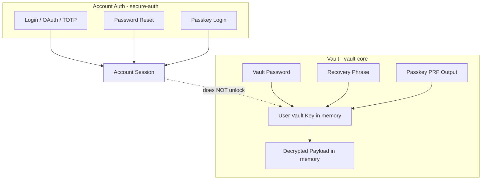

# Vault Core Extraction Plan

**Target package:** `@tgoliveira/vault-core`  
**Source:** [LiqSense](https://github.com/tgoliveira11/liqsense) `src/modules/vault/`  
**Date:** 2026-06-18  
**Status:** Analysis / planning only (no implementation in this document)

---

## 1. Executive summary

### Is the current LiqSense vault stable enough to extract?

**Yes, with conditions.** The LiqSense vault module is already organized into a clean `core / client / server / components / hooks` split, has extensive Vitest coverage (crypto roundtrips, recovery, passkey PRF, no-plaintext guards, session boundaries, API validation), and documents a coherent security model. The cryptographic primitives (AES-GCM, Argon2id via `hash-wasm`, BIP39 recovery phrases via `@scure/bip39`, passkey PRF envelope wrapping) are stable and intentionally isolated from account auth.

The main extraction risk is **not instability** but **accidental format drift**: several security-relevant constants are currently LiqSense-branded (`liqsense:vault:v1`, `liqsense-passkey-prf-v1:`). Existing encrypted blobs and envelopes depend on those exact values. Extraction must preserve them for LiqSense via an explicit app crypto profile, not replace them with generic defaults.

### What should become reusable?

- AES-GCM field encryption/decryption with canonical AAD
- Argon2id KDF helpers and metadata serialization
- User Vault Key generation (Web Crypto)
- Password, recovery phrase, and passkey PRF envelopes
- BIP39 recovery phrase generation, normalization, validation, confirmation helpers
- Generic encrypted payload envelope format and versioning contracts
- Vault error types and no-plaintext rejection utilities
- Optional browser session helpers (in-memory UVK, auto-lock timer, pagehide guard)
- Optional recovery kit **text builder** (template-driven, not LiqSense-branded hardcoding)
- Server-side AAD assertion helpers (framework-independent)
- Zod schemas for encrypted structures (optional export)

### What should remain LiqSense-specific?

- `LiqSenseVaultPayloadV1` / `LiqSenseVaultPayloadV2` and migration to subscription secrets
- Drizzle repository, DB schema, API route handlers
- React UI, hooks wired to LiqSense routes and secure-auth password UI
- Passkey PRF WebAuthn ceremony integrated with `@tgoliveira/secure-auth`
- Product copy, dashboard integration, monitoring/subscription mapping
- LiqSense-specific no-plaintext sentinel extensions (subscription tokens, alert keys)
- Env-driven vault password policy wiring

### Main risks

| Risk | Severity | Mitigation |
| --- | --- | --- |
| AAD context change breaks existing vaults | Critical | App crypto profile with LiqSense defaults frozen at current strings |
| Argon2id params drift | High | Export and freeze `DEFAULT_ARGON2ID_PARAMS`; compatibility fixtures |
| Package accidentally imports secure-auth / Next / React | High | Boundary tests in both repos |
| Session UVK holder duplicated or diverges | Medium | Extract once; LiqSense re-exports thin wrapper if needed |
| Passkey PRF browser variance | Medium | Keep ceremony in app; core only wraps/unwraps PRF output |
| Over-extracting product schema into core | Medium | Generic JSON payload API; LiqSense owns typed payload |
| npm publish before LiqSense validates dependency | Medium | Local `file:` / workspace link during Phase B–D |

### Recommended extraction strategy

Use a **strangler migration**:

1. Create `@tgoliveira/vault-core` in the dedicated `vault-core` repo (already provisioned).
2. Copy **pure core modules first** behind identical function names, with LiqSense passing a frozen `VaultCryptoProfile`.
3. Point LiqSense imports at the package incrementally (core → client helpers → validation).
4. Leave UI, API routes, DB, and product payload schema untouched until imports stabilize.
5. Delete duplicated local core code only after parity tests pass.

Do **not** rewrite LiqSense vault flows. Do **not** change encrypted on-disk/on-DB formats as part of extraction.

### Separate repo vs monorepo vs in-repo package?

**Recommended default (least disruptive):**

```
Separate repo: @tgoliveira/vault-core
Consumption: npm dependency (file:../vault-core during development)
LiqSense: remains a single Next.js app, no monorepo conversion required
```

Rationale:

- Matches the existing empty `vault-core` workspace and published-package intent.
- Avoids monorepo tooling churn in LiqSense.
- Keeps vault-core reusable by other products without coupling to LiqSense release cadence.
- LiqSense can pin a semver range once stable.

**Alternative (acceptable but more churn):** `packages/vault-core` inside a future LiqSense monorepo — only worth it if multiple packages will ship together soon.

---

## 2. Current LiqSense vault inventory

Classification legend:

- **RC** — Reusable core
- **RB** — Reusable browser/client helper
- **RR** — Reusable React helper (defer extraction)
- **API** — App-specific API/server integration
- **UI** — App-specific UI
- **PS** — LiqSense-specific product schema
- **NE** — Do not extract

| File/path | Current role | Reusable? | Extraction target | Notes |
| --- | --- | ---: | --- | --- |
| `src/modules/vault/core/constants.ts` | Crypto version, AAD contexts, PRF salt prefix, auto-lock default | Partial | RC (profile-driven) | Must preserve LiqSense string values for compatibility |
| `src/modules/vault/core/types.ts` | Zod schemas for encrypted payload, KDF metadata, envelopes, status types | Yes | RC | Split server status types: generic vs app |
| `src/modules/vault/core/errors.ts` | Vault error classes | Yes | RC | |
| `src/modules/vault/core/no-plaintext.ts` | Forbidden field list, sentinels, scan helpers | Partial | RC + app extension | Core list + extensible sentinels |
| `src/modules/vault/core/vault-key.ts` | UVK generation + module session holder | Partial | RC (gen) + RB (session) | Session state is client concern |
| `src/modules/vault/core/vault-payload.ts` | Encrypt/decrypt LiqSense payload, migration hook | Partial | RC (generic JSON) + PS (LiqSense wrapper) | App wrapper calls generic core |
| `src/modules/vault/core/vault-schema.ts` | LiqSense payload V1 | No | PS | Stays in LiqSense |
| `src/modules/vault/core/vault-schema-v2.ts` | LiqSense payload V2 + Aave subscription secrets | No | PS | Imports monitoring thresholds |
| `src/modules/vault/core/crypto/aes-gcm.ts` | AES-GCM encrypt/decrypt field | Yes | RC | Web Crypto |
| `src/modules/vault/core/crypto/aad.ts` | Canonical AAD string + legacy candidates | Yes | RC | Backward compat critical |
| `src/modules/vault/core/crypto/encoding.ts` | Base64url, UTF-8 bytes | Yes | RC | Browser + Node (btoa/atob) |
| `src/modules/vault/core/crypto/random.ts` | `crypto.getRandomValues` wrapper | Yes | RC | |
| `src/modules/vault/core/crypto/serialization.ts` | JSON serialize/parse payload | Yes | RC | |
| `src/modules/vault/core/kdf/params.ts` | Default Argon2id params | Yes | RC | Freeze for compat |
| `src/modules/vault/core/kdf/argon2id.ts` | Argon2id derive + metadata | Yes | RC | Depends on `hash-wasm` |
| `src/modules/vault/core/envelopes/password-envelope.ts` | Password wrap/unwrap UVK | Yes | RC | |
| `src/modules/vault/core/envelopes/recovery-envelope.ts` | BIP39 phrase + recovery wrap/unwrap | Yes | RC | Depends on `@scure/bip39` |
| `src/modules/vault/core/envelopes/passkey-prf-envelope.ts` | PRF wrap/unwrap + capability checks | Partial | RC | Browser checks; no WebAuthn ceremony |
| `src/modules/vault/client/vault-client.ts` | Setup/unlock orchestration + fetch to LiqSense APIs | Partial | RB + PS | Generic setup helpers extractable; fetch stays |
| `src/modules/vault/client/vault-session.ts` | Auto-lock, pagehide, session listeners | Yes | RB | Uses `NEXT_PUBLIC_*` env — inject config |
| `src/modules/vault/client/vault-storage.ts` | localStorage/IndexedDB guards | Yes | RB | Prefix configurable |
| `src/modules/vault/client/recovery.ts` | Re-export recovery helpers | No | RC (source already core) | Delete after package import |
| `src/modules/vault/client/recovery-kit.ts` | LiqSense-branded kit download/print | Partial | RB (text builder in RC) | Branding stays in LiqSense |
| `src/modules/vault/client/passkey-prf.ts` | PRF salt + extension builder | Partial | RB | Salt prefix from profile |
| `src/modules/vault/client/passkey-vault-unlock.ts` | WebAuthn ceremony via secure-auth | No | API | secure-auth coupling |
| `src/modules/vault/client/vault-save.ts` | Encrypt + PATCH LiqSense record | No | PS | |
| `src/modules/vault/client/vault-unlock-errors.ts` | User-facing unlock error copy | No | UI | |
| `src/modules/vault/client/vault-password-validation.ts` | Vault password policy via secure-auth | No | NE (app) | Uses secure-auth validators |
| `src/modules/vault/client/vault-password-policy.ts` | Env-driven policy config | No | NE (app) | |
| `src/modules/vault/server/vault-records.service.ts` | Business logic for vault CRUD | No | API | |
| `src/modules/vault/server/vault-records.repository.ts` | Drizzle persistence | No | API | |
| `src/modules/vault/server/vault-validation.ts` | Zod API input schemas | Partial | RC (schemas) + API (routes) | Schemas portable with profile |
| `src/modules/vault/server/aad-validation.ts` | Server AAD checks | Yes | RC | Parameterize contexts |
| `src/modules/vault/server/vault-records.routes.ts` | Next.js response helpers | No | API | Next-specific |
| `src/modules/vault/hooks/useVault.ts` | React vault hook | No | RR | Defer |
| `src/modules/vault/hooks/useVaultStatus.ts` | React status hook | No | RR | Defer |
| `src/modules/vault/components/*` | Setup/unlock/settings UI | No | UI | secure-auth + Next Link |
| `src/app/vault/setup/*` | Setup pages | No | UI | |
| `src/app/vault/unlock/*` | Unlock pages | No | UI | |
| `src/app/vault/settings/*` | Settings pages | No | UI | |
| `src/app/api/vault/*` | REST endpoints | No | API | |
| `src/lib/db/schema/vault.ts` | `vault_records` table | No | API | Types import from core |
| `docs/VAULT_*.md` | Architecture/security docs | N/A | Docs | Update references post-extract |
| `src/modules/vault/__tests__/*` | Module tests | Partial | Split | Core tests → package; integration → LiqSense |
| `src/test/boundaries.test.ts` | Global boundary tests | Partial | LiqSense | Add package boundary tests in vault-core |

**Test inventory (19 test files under `src/modules/vault/__tests__/`):**

| Test file | Primary focus | Target after extraction |
| --- | --- | --- |
| `crypto-roundtrip.test.ts` | Envelopes + payload roundtrip | vault-core |
| `recovery-generation.test.ts` | Phrase generation + setup | Split |
| `recovery-confirmation.test.ts` | Word confirmation | vault-core |
| `recovery-unlock.test.ts` | Recovery unwrap | vault-core |
| `recovery-kit.test.ts` | Kit content | Split (template in core) |
| `passkey-prf.test.ts` | PRF envelope | vault-core |
| `no-plaintext.test.ts` | Plaintext rejection | vault-core |
| `api-validation.test.ts` | Zod setup schema | Split |
| `db-persistence.test.ts` | Sentinel absence in persisted shape | LiqSense |
| `vault-session.test.ts` | Session/auto-lock | Split (`@tgoliveira/vault-core/browser`) |
| `vault-boundaries.test.ts` | Auth separation static checks | LiqSense |
| `vault-password-security.test.ts` | secure-auth integration | LiqSense |
| `vault-password-validation.test.ts` | Policy validation | LiqSense |
| `vault-unlock-errors.test.ts` | Error formatting | LiqSense |
| `vault-setup-form.test.tsx` | UI | LiqSense |
| `recovery-phrase-panel.test.tsx` | UI | LiqSense |
| `selahkeep-terms.test.ts` | Legacy term guard | LiqSense |
| `vault-test-ui.tsx` | Test helper | LiqSense |

---

## 3. Proposed package boundaries

### `@tgoliveira/vault-core` (Phase 1 — extract now)

Framework-independent TypeScript library:

```
crypto primitives
key management (generation, not app session wiring)
envelope models + wrap/unwrap
recovery phrase utilities
encrypted payload format (generic JSON)
schema/versioning contracts
validation helpers (AAD assert, plaintext reject)
no-plaintext test utilities
VaultCryptoProfile (app-specific AAD/PRF prefix)
```

### LiqSense app (stays)

```
DB persistence (vault_records)
API routes + Next response helpers
React screens + hooks
LiqSense vault payload schema (V1/V2)
Monitoring subscription mapping
Wallet labels, strategy notes, alert keys
Auth session checks (requireSessionUser)
secure-auth password UI integration
Passkey PRF ceremony (WebAuthn + secure-auth)
Product copy and dashboard integration
```

### Optional future packages (Phase 2+ — do not block extraction)

| Package | Contents | Justification |
| --- | --- | --- |
| `@tgoliveira/vault-react` | Session provider, headless unlock hooks | Only if 2+ apps need identical React wiring |
| `@tgoliveira/vault-next` | Route helpers, no-store headers, zod route parsers | Only if Next.js patterns repeat across apps |

**Recommendation:** Extract **core only first.** React components in LiqSense tightly integrate secure-auth `PasswordSetupFields`, Next `Link`, and product copy — extracting them now would either couple vault-react to secure-auth or duplicate UI. Not justified yet.

### Critical boundary: account auth vs vault unlock

```
@tgoliveira/secure-auth  →  account login, reset, TOTP, OAuth, passkey login
@tgoliveira/vault-core     →  UVK, envelopes, encrypted payload (no session auth)
LiqSense app               →  wires both; never merges unlock paths
```

The package must not import secure-auth, NextAuth, or inspect account sessions.

---

## 4. What belongs in `@tgoliveira/vault-core`

### 4.1 Vault crypto profile (new — required for multi-app reuse)

Introduce a single configuration object passed into envelope/payload operations:

```ts
type VaultCryptoProfile = {
  cryptoVersion: "vault-v1";           // stored server-side
  aadContextVault: string;             // LiqSense: "liqsense:vault:v1"
  aadContextEnvelope: string;          // LiqSense: "liqsense:vault-envelope:v1"
  prfSaltPrefix?: string;              // LiqSense: "liqsense-passkey-prf-v1:"
};
```

**Why reusable:** Removes hardcoded LiqSense strings from core while preserving existing ciphertext for LiqSense via frozen profile.  
**Dependencies:** None.  
**Runtime:** Universal.  
**Export:** Public (`VaultCryptoProfile`, `LIQSENSE_VAULT_CRYPTO_PROFILE` constant optional in docs only — not in core).

---

### 4.2 Vault keys

| API | Why | Dependencies | Runtime | Public? |
| --- | --- | --- | --- | --- |
| `createUserVaultKey()` | 256-bit AES-GCM UVK generation | Web Crypto | Browser + Node 20+ | Yes |
| `exportUserVaultKey` / `importUserVaultKey` | Testing, envelope wrap | Web Crypto | Browser + Node | Yes (advanced) |

**Note:** Module-level session holder (`getSessionVaultKey`, `setSessionVaultKey`, `lockVault`) moves to `@tgoliveira/vault-core/browser`, not the default export, so Node consumers and tests do not inherit hidden global state.

---

### 4.3 AES-GCM encryption/decryption

| API | Why | Dependencies | Runtime | Public? |
| --- | --- | --- | --- | --- |
| `encryptField(plaintext, key, aad)` | Envelope + payload encryption | Web Crypto | Browser + Node | Yes |
| `decryptField(payload, key)` | Decrypt with AAD candidate fallback | Web Crypto | Browser + Node | Yes |
| `canonicalAadString`, `aadByteCandidates` | Compatibility + tamper binding | None | Universal | Yes |

Preserve existing AAD JSON key ordering variants in `aadByteCandidates` — required for backward compatibility.

---

### 4.4 Argon2id KDF helpers

| API | Why | Dependencies | Runtime | Public? |
| --- | --- | --- | --- | --- |
| `deriveArgon2idAesKey` | Password/recovery wrapping | `hash-wasm` | Browser + Node (WASM) | Yes |
| `deriveVaultPasswordKey` / `FromMetadata` | Password envelope | `hash-wasm` | Browser + Node | Yes |
| `DEFAULT_ARGON2ID_PARAMS` | `{ memory: 65536, iterations: 3, parallelism: 1, hashLength: 32, saltLength: 16 }` | None | Universal | Yes |
| `serializeArgon2idMetadata` / `parseArgon2idMetadata` | Persisted envelope metadata | None | Universal | Yes |

Password normalization: NFKC (preserve current behavior).

---

### 4.5 Password envelope

| API | Why | Dependencies | Runtime | Public? |
| --- | --- | --- | --- | --- |
| `createPasswordEnvelope(...)` | Wrap UVK with vault password | Argon2id + AES-GCM | Browser + Node | Yes |
| `unlockWithPasswordEnvelope(...)` | Unwrap UVK | Same | Browser + Node | Yes |

Alias current names: `wrapVaultKeyForPassword` → `createPasswordEnvelope`, `unwrapVaultKeyFromPassword` → `unlockWithPasswordEnvelope` (keep deprecated aliases one release).

---

### 4.6 Recovery phrase envelope

| API | Why | Dependencies | Runtime | Public? |
| --- | --- | --- | --- | --- |
| `createRecoveryPhrase({ wordCount: 12 \| 24 })` | BIP39 generation | `@scure/bip39` | Browser + Node | Yes |
| `normalizeRecoveryPhrase`, `validateRecoveryPhraseFormat` | Input hygiene | `@scure/bip39` | Universal | Yes |
| `getRecoveryPhraseWordCount`, `parseRecoveryPhraseWordCount` | 12/24 enforcement | None | Universal | Yes |
| `getRecoveryConfirmationPromptCount` | 3 for 12 words, 4 for 24 | None | Universal | Yes |
| `pickRecoveryConfirmationIndices` | Deterministic confirmation UX | None | Universal | Yes |
| `assertRecoveryPhraseWordConfirmation` | Setup confirmation | None | Universal | Yes |
| `assertRecoveryPhraseUnlockInput` | Unlock validation | None | Universal | Yes |
| `createRecoveryEnvelope` / `unlockWithRecoveryEnvelope` | Wrap UVK with phrase | Argon2id + AES-GCM | Browser + Node | Yes |
| `RECOVERY_PHRASE_WORDLIST_SOURCE` | Documentation constant | None | Universal | Yes |

Wordlist: **BIP39 English** via `@scure/bip39` (current behavior — do not change).

---

### 4.7 Passkey PRF envelope model

| API | Why | Dependencies | Runtime | Public? |
| --- | --- | --- | --- | --- |
| `createPasskeyPrfEnvelope` | Wrap UVK with PRF output | Web Crypto | Browser (+ Node tests with raw bytes) | Yes |
| `unlockWithPasskeyPrfEnvelope` | Unwrap UVK | Web Crypto | Browser | Yes |
| `extractPasskeyPrfOutput` | Parse extension results | None | Browser | Yes (`/browser`) |
| `isPasskeySupported`, `isPrfExtensionSupported` | Capability probes | None | Browser | Yes (`/browser`) |
| `buildPrfSaltBytes(prefix, userId)` | SHA-256 salt | Web Crypto | Browser | Yes (`/browser`) |

**Do not export:** WebAuthn ceremony, `@simplewebauthn/browser`, secure-auth passkey login.

---

### 4.8 Encrypted payload envelope (generic)

| API | Why | Dependencies | Runtime | Public? |
| --- | --- | --- | --- | --- |
| `encryptVaultPayload<T>(payload, key, aadScope, profile)` | Generic JSON encryption | AES-GCM | Browser + Node | Yes |
| `decryptVaultPayload<T>(encrypted, key)` | Generic JSON decryption | AES-GCM | Browser + Node | Yes |
| `encryptedPayloadSchema` (Zod) | Server/client contract | `zod` | Universal | Yes |
| `ENCRYPTION_VERSION`, `ENCRYPTION_ALG` | `enc-v1`, `AES-GCM` | None | Universal | Yes |

LiqSense typed payload encrypt/decrypt becomes a thin app function calling generic core + `parse`/`migrate` locally.

---

### 4.9 Recovery kit generation helpers

| API | Why | Dependencies | Runtime | Public? |
| --- | --- | --- | --- | --- |
| `createRecoveryKitText({ phrase, wordCount, productName, ... })` | Printable kit content | None | Universal | Yes |
| `downloadRecoveryKit` / `printRecoveryKit` | DOM helpers | DOM | Browser only | Optional `/browser` |

LiqSense-specific filename (`liqsense-vault-recovery-kit.txt`) and copy stay in the app.

---

### 4.10 Vault status / error models

| Type | In core? | Notes |
| --- | --- | --- |
| `VaultCryptoVersion` | Yes | `"vault-v1"` |
| `EncryptedPayload`, `StoredEnvelope`, `KdfMetadata` | Yes | |
| `VaultEnvelopeMethod` | Yes | |
| `RecoveryPhraseWordCount` | Yes | `12 \| 24` |
| `VaultUnlockResult<TPayload>` | Yes | `{ vaultKey, payload }` — payload typed by app |
| `VaultLockState` | Browser helper | `'locked' \| 'unlocked'` |
| `VaultCoreError` + subclasses | Yes | Plaintext rejection, passkey, recovery confirmation |
| `VaultServerStatus` | No (app) | LiqSense API shape can mirror core fields |

---

### 4.11 No-plaintext guards / test utilities

| API | Why | Export |
| --- | --- | --- |
| `PLAINTEXT_FORBIDDEN_VAULT_FIELDS` | Core vault secrets | Public |
| `assertNoVaultPlaintextFields` | Server route guard | Public |
| `SENTINEL_*` base set | Test doubles | `@tgoliveira/vault-core/testing` |
| `scanForSentinels` | Persistence tests | `@tgoliveira/vault-core/testing` |
| `extendForbiddenFields`, `extendSentinels` | App-specific (tokens, notes) | Public optional config |

---

## 5. What must stay outside `@tgoliveira/vault-core`

| Category | Examples | Reason |
| --- | --- | --- |
| Product payload schema | `LiqSenseVaultPayloadV2`, subscription secrets, Aave fields | Domain-specific |
| Monitoring integration | `MonitorThresholds`, read/management tokens, alert private keys | Privacy product model |
| Wallet/product data | Wallet labels, strategy names, private notes | App semantics |
| Database | `vault_records`, Drizzle repository | Storage choice |
| API layer | `/api/vault/*`, `requireSessionUser` | Framework + auth |
| Account auth | secure-auth, NextAuth, OAuth, TOTP, password reset | Explicit separation |
| Passkey login ceremony | `performPasskeyPrfCeremony`, secure-auth `passkeyLoginApi` | Auth coupling |
| Password policy UI | `PasswordSetupFields`, env policy wiring | secure-auth owns control |
| UI/routes | `/vault/setup`, components, dashboard cards | Product UX |
| Next.js helpers | `NextResponse`, `vaultJsonResponse` | Framework |
| LiqSense sentinels | `SENTINEL_SUBSCRIPTION_TOKEN`, etc. | App boundary tests |
| Payload migration V1→V2 | `migrateVaultPayloadToV2` | LiqSense evolution |

---

## 6. Proposed public API

### 6.1 Configuration

```ts
export type VaultCryptoProfile = {
  cryptoVersion: "vault-v1";
  aadContextVault: string;
  aadContextEnvelope: string;
};

export type VaultAadScope = {
  userId: string;
  resourceId: string;
  field: "vault_key" | "vault_payload" | "vault_index";
};

export type VaultCryptoVersion = "vault-v1";
export type RecoveryPhraseWordCount = 12 | 24;
```

### 6.2 Keys

```ts
export async function createUserVaultKey(): Promise<CryptoKey>;

export type UserVaultKey = CryptoKey; // documentation alias
```

### 6.3 Payload

```ts
export type EncryptedVaultPayload = EncryptedPayload; // zod-validated shape

export async function encryptVaultPayload<T>(
  payload: T,
  vaultKey: CryptoKey,
  scope: VaultAadScope,
  profile: VaultCryptoProfile
): Promise<EncryptedVaultPayload>;

export async function decryptVaultPayload<T>(
  encrypted: EncryptedVaultPayload,
  vaultKey: CryptoKey
): Promise<T>;
```

### 6.4 Envelopes

```ts
export type VaultEnvelopeMethod = "password" | "recovery_phrase" | "passkey_prf";

export type VaultEnvelope = {
  method: VaultEnvelopeMethod;
  encryptedVaultKey: EncryptedVaultPayload;
  kdfMetadata: Argon2idKdfMetadata | null;
  publicMetadata?: Record<string, unknown>;
};

export type PasswordEnvelope = VaultEnvelope & { method: "password"; kdfMetadata: Argon2idKdfMetadata };
export type RecoveryPhraseEnvelope = VaultEnvelope & { method: "recovery_phrase"; kdfMetadata: Argon2idKdfMetadata };
export type PasskeyPrfEnvelope = VaultEnvelope & { method: "passkey_prf"; kdfMetadata: null };

export async function createPasswordEnvelope(
  vaultKey: CryptoKey,
  vaultPassword: string,
  scope: VaultAadScope,
  profile: VaultCryptoProfile
): Promise<PasswordEnvelope>;

export async function unlockWithPasswordEnvelope(
  vaultPassword: string,
  envelope: PasswordEnvelope
): Promise<CryptoKey>;

export function createRecoveryPhrase(options: {
  wordCount: RecoveryPhraseWordCount;
}): string;

export async function createRecoveryEnvelope(
  vaultKey: CryptoKey,
  recoveryPhrase: string,
  scope: VaultAadScope,
  profile: VaultCryptoProfile,
  publicMetadata?: { phraseLength: RecoveryPhraseWordCount }
): Promise<RecoveryPhraseEnvelope>;

export async function unlockWithRecoveryEnvelope(
  recoveryPhrase: string,
  envelope: RecoveryPhraseEnvelope,
  options?: { expectedWordCount?: RecoveryPhraseWordCount | null }
): Promise<CryptoKey>;

export async function createPasskeyPrfEnvelope(
  vaultKey: CryptoKey,
  prfOutput: Uint8Array,
  scope: VaultAadScope,
  profile: VaultCryptoProfile
): Promise<PasskeyPrfEnvelope>;

export async function unlockWithPasskeyPrfEnvelope(
  envelope: PasskeyPrfEnvelope,
  prfOutput: Uint8Array | null,
  options?: { prfRequired?: boolean }
): Promise<CryptoKey>;
```

### 6.5 Recovery UX helpers

```ts
export function createRecoveryKitText(input: {
  recoveryPhrase: string;
  wordCount: RecoveryPhraseWordCount;
  productName: string;
  createdAt?: Date;
  warnings?: string[];
}): string;

export function pickRecoveryConfirmationIndices(
  wordCount: number,
  count?: number
): number[];

export function assertRecoveryPhraseWordConfirmation(
  originalPhrase: string,
  answers: Record<number, string>
): void;
```

### 6.6 Validation / security

```ts
export function assertVaultKeyAad(
  userId: string,
  payload: EncryptedVaultPayload,
  profile: VaultCryptoProfile
): void;

export function assertVaultPayloadAad(
  userId: string,
  payload: EncryptedVaultPayload,
  profile: VaultCryptoProfile
): void;

export function assertNoVaultPlaintextFields(body: Record<string, unknown>): void;
```

### 6.7 Unlock result (app layer pattern)

```ts
export type VaultUnlockResult<TPayload> = {
  vaultKey: CryptoKey;
  payload: TPayload;
};

// LiqSense wrapper example (stays in app):
export async function unlockLiqSenseVault(
  method: VaultEnvelopeMethod,
  secret: string | Uint8Array,
  envelope: VaultEnvelope,
  encryptedBlob: EncryptedVaultPayload,
  profile: VaultCryptoProfile
): Promise<VaultUnlockResult<LiqSenseVaultPayloadV2>> {
  const vaultKey = await unlockWithPasswordEnvelope(/* or other */);
  const payload = normalizeVaultPayload(
    await decryptVaultPayload(encryptedBlob, vaultKey)
  );
  return { vaultKey, payload };
}
```

### 6.8 Errors

```ts
export type VaultCoreError =
  | VaultPlaintextRejectionError
  | PasskeyPrfRequiredError
  | PasskeyUnlockError
  | RecoveryPhraseConfirmationError;
```

---

## 7. Runtime and dependency strategy

### Answers

| Dependency | Needed? | Notes |
| --- | --- | --- |
| Web Crypto (`crypto.subtle`) | **Yes** | Primary crypto backend; Node 20+ global `crypto` |
| Node `crypto` module | **No** | Avoid dual backends; stick to Web Crypto API |
| `hash-wasm` (Argon2id) | **Yes** | Current implementation; WASM works in browser + Node |
| `@scure/bip39` | **Yes** | Recovery phrase generation/validation |
| `zod` | **Yes** | Encrypted payload + envelope schemas (optional peer if apps want lighter bundle — default: direct dependency) |
| React | **No** | Core only |
| Next.js | **No** | |
| secure-auth | **No** | |
| `@simplewebauthn/browser` | **No** | Ceremony stays in app |

### Browser-only separation

| Module | Entry |
| --- | --- |
| Session UVK store, auto-lock, pagehide | `@tgoliveira/vault-core/browser` |
| PRF capability probes, DOM recovery kit download/print | `@tgoliveira/vault-core/browser` |
| Crypto, KDF, envelopes, recovery phrase | `@tgoliveira/vault-core` (main) |
| Sentinels, scan helpers | `@tgoliveira/vault-core/testing` |

### Proposed `package.json` exports

```json
{
  "name": "@tgoliveira/vault-core",
  "type": "module",
  "exports": {
    ".": {
      "types": "./dist/index.d.ts",
      "import": "./dist/index.js"
    },
    "./browser": {
      "types": "./dist/browser.d.ts",
      "import": "./dist/browser.js"
    },
    "./testing": {
      "types": "./dist/testing.d.ts",
      "import": "./dist/testing.js"
    }
  },
  "dependencies": {
    "@scure/bip39": "^2.2.0",
    "hash-wasm": "^4.12.0",
    "zod": "^4.4.3"
  },
  "engines": {
    "node": ">=20"
  }
}
```

### SSR / browser boundaries

- All encryption runs client-side in LiqSense today — preserve that.
- Main entry must not reference `window`, `document`, or `localStorage`.
- LiqSense Next.js routes only handle encrypted blobs; SSR does not need vault-core on server except optional AAD validation (Node 20 Web Crypto).

### Encoding note

Current `encoding.ts` uses `btoa`/`atob`. For Node tests, ensure vitest environment provides these (Node 20+ has `globalThis.btoa`) or add a tiny fallback in core.

---

## 8. Package structure proposal

### Separate repo layout (recommended)

```text
@tgoliveira/vault-core/
  src/
    index.ts                    # public barrel
    browser.ts                  # browser-only barrel
    testing.ts                  # sentinels + scan helpers
    profile.ts                  # VaultCryptoProfile types
    constants.ts                # ENCRYPTION_VERSION, VAULT_CRYPTO_VERSION defaults
    crypto/
      aes-gcm.ts
      aad.ts
      encoding.ts
      random.ts
      serialization.ts
    kdf/
      argon2id.ts
      params.ts
    keys/
      user-vault-key.ts
    envelopes/
      types.ts
      password.ts
      recovery.ts
      passkey-prf.ts
    recovery/
      phrase.ts
      confirmation.ts
      kit.ts
    payload/
      encrypted-payload.ts
    validation/
      aad-assert.ts
      plaintext-reject.ts
      schemas.ts                # zod
    errors/
      vault-errors.ts
    session/
      memory-session.ts         # browser entry re-export
      auto-lock.ts
    testing/
      no-plaintext.ts
      fixtures/                 # LiqSense compatibility vectors (generated from current impl)
  package.json
  tsconfig.json
  vitest.config.ts
  README.md
  SECURITY.md
  ARCHITECTURE.md
```

### LiqSense consumption after extraction

```text
liqsense/
  src/modules/vault/
    liqsense-profile.ts         # frozen AAD contexts
    liqsense-payload.ts         # V1/V2 schema + migrate
    client/                     # API fetch, passkey ceremony, save
    server/                     # Drizzle + routes
    components/                 # UI unchanged
    hooks/                      # React unchanged
```

```ts
// liqsense/src/modules/vault/liqsense-profile.ts
import type { VaultCryptoProfile } from "@tgoliveira/vault-core";

export const LIQSENSE_VAULT_PROFILE: VaultCryptoProfile = {
  cryptoVersion: "vault-v1",
  aadContextVault: "liqsense:vault:v1",
  aadContextEnvelope: "liqsense:vault-envelope:v1",
};

export const LIQSENSE_PRF_SALT_PREFIX = "liqsense-passkey-prf-v1:";
```

Install during development:

```json
"@tgoliveira/vault-core": "file:../vault-core"
```

---

## 9. Migration strategy for LiqSense

### Phase A — Stabilize current LiqSense vault tests

| Item | Detail |
| --- | --- |
| **Goal** | Establish green baseline before any move |
| **Files** | None changed; run existing suite |
| **Tests** | `npm run test -- src/modules/vault`, `npm run validate` |
| **Rollback** | N/A |
| **Risk** | Low |

**Action:** Capture compatibility fixtures from current implementation (encrypted blob + envelopes for 12/24-word, password unlock) into a committed JSON fixture file in vault-core repo.

---

### Phase B — Extract pure crypto/recovery helpers behind identical APIs

| Item | Detail |
| --- | --- |
| **Goal** | vault-core package with parity tests matching LiqSense outputs |
| **Files** | New vault-core repo; copy from `core/crypto`, `core/kdf`, `core/envelopes`, `core/errors`, partial `no-plaintext` |
| **Tests** | Port `crypto-roundtrip`, `recovery-*`, `passkey-prf`, `no-plaintext` to vault-core |
| **Rollback** | LiqSense still uses local core; ignore package |
| **Risk** | Medium (subtle AAD/Argon2 drift) |

**Gate:** Byte-identical ciphertext for fixture inputs OR documented acceptable variance (there should be none).

---

### Phase C — Replace LiqSense imports with package imports

| Item | Detail |
| --- | --- |
| **Goal** | LiqSense `core/*` re-exports or direct `@tgoliveira/vault-core` imports |
| **Files** | `src/modules/vault/core/**/*.ts` → thin wrappers or delete |
| **Tests** | All LiqSense vault tests still green |
| **Rollback** | Revert dependency; restore local core |
| **Risk** | Low–medium |

Use re-export shim temporarily to avoid wide diff:

```ts
// src/modules/vault/core/envelopes/password-envelope.ts
export {
  createPasswordEnvelope as wrapVaultKeyForPassword,
  unlockWithPasswordEnvelope as unwrapVaultKeyFromPassword,
} from "@tgoliveira/vault-core";
```

---

### Phase D — Extract envelope types and payload envelope logic

| Item | Detail |
| --- | --- |
| **Goal** | Generic payload encrypt/decrypt in package; LiqSense wrapper for V2 |
| **Files** | `vault-payload.ts` split; `vault-schema*.ts` stay |
| **Tests** | `crypto-roundtrip`, `db-persistence` |
| **Rollback** | Keep local `vault-payload.ts` |
| **Risk** | Medium |

---

### Phase E — Keep LiqSense UI/API/routes unchanged

| Item | Detail |
| --- | --- |
| **Goal** | No user-visible or API contract changes |
| **Files** | None in `app/`, `components/` |
| **Tests** | UI tests, `vault-boundaries`, integration |
| **Rollback** | N/A |
| **Risk** | Low |

---

### Phase F — Remove duplicated local vault-core code

| Item | Detail |
| --- | --- |
| **Goal** | Delete copied core files; single source in package |
| **Files** | Remove `src/modules/vault/core/crypto`, `kdf`, `envelopes`, etc. |
| **Tests** | Full validate |
| **Rollback** | Restore from git |
| **Risk** | Low if prior phases green |

---

### Phase G — Add package-level docs and examples

| Item | Detail |
| --- | --- |
| **Goal** | Publishable package with security docs and LiqSense migration guide |
| **Files** | vault-core docs (Section 13) |
| **Tests** | CI in vault-core repo |
| **Rollback** | N/A |
| **Risk** | Low |

---

## 10. Compatibility requirements

Extraction **must not break** existing LiqSense vault records. The following are frozen contracts:

### Encrypted payload format

| Field | Value | Compatible? |
| --- | --- | --- |
| `version` | `enc-v1` | Yes — preserve |
| `alg` | `AES-GCM` | Yes |
| `iv` | 12-byte random, base64url | Yes |
| `aad.field` | `vault_payload` for blob, `vault_key` for envelopes | Yes |
| `aad.context` | `liqsense:vault:v1` / `liqsense:vault-envelope:v1` | Yes via profile |
| Plaintext | JSON serialized LiqSense payload | App schema unchanged |

### Envelope version compatibility

| Envelope | KDF | Compatible |
| --- | --- | --- |
| Password | Argon2id `kdf-v1`, default params | Yes |
| Recovery | Argon2id over normalized BIP39 phrase | Yes |
| Passkey PRF | Raw PRF bytes → AES-256-GCM key, `kdfMetadata: null` | Yes |

### Recovery phrase compatibility

| Feature | Status |
| --- | --- |
| 12-word BIP39 | Supported — must remain |
| 24-word BIP39 (default) | Supported — must remain |
| `publicMetadata.phraseLength` | 12 or 24 — preserve parsing |
| Legacy vaults without metadata | Unlock accepts valid 12 or 24 words — preserve |
| Confirmation counts (3/4) | Preserve |

### Unlock method compatibility

| Method | Requirement |
| --- | --- |
| Password | NFKC normalization preserved |
| Recovery | Lowercase normalized whitespace-separated words |
| Passkey PRF | Salt `SHA-256("liqsense-passkey-prf-v1:{userId}")` unchanged |

### Database records

`vault_records` columns unchanged. JSONB envelope shapes unchanged. `crypto_version = "vault-v1"`.

### Required tests before extraction approval

1. **Golden fixture test:** Known UVK + password + phrase → exact `encryptedVaultKey` bytes (password + recovery envelopes).
2. **LiqSense blob roundtrip:** Decrypt production-shaped fixture with package API.
3. **AAD mismatch test:** Wrong userId/context fails decrypt.
4. **Legacy AAD candidate test:** Decrypt using alternate JSON key order paths.
5. **12 vs 24 metadata enforcement test.**

If any golden test fails during Phase B, stop and fix before LiqSense import swap.

---

## 11. Test plan

### Package tests (`@tgoliveira/vault-core`)

- [ ] AES-GCM encrypt/decrypt roundtrip
- [ ] Wrong key fails decrypt
- [ ] Wrong AAD fails decrypt
- [ ] Tampered ciphertext fails decrypt
- [ ] AAD legacy candidate order compatibility
- [ ] Password envelope create/unlock
- [ ] Recovery envelope create/unlock (12-word)
- [ ] Recovery envelope create/unlock (24-word)
- [ ] Recovery phrase generation/format validation
- [ ] Recovery confirmation indices + word confirmation
- [ ] Recovery kit text generation (template)
- [ ] Passkey PRF envelope create/unlock
- [ ] PRF output too short rejected
- [ ] `encryptedPayloadSchema` validation
- [ ] Argon2id metadata serialize/parse
- [ ] No-plaintext field rejection
- [ ] Sentinel scan helpers
- [ ] **Backwards compatibility fixtures** (LiqSense golden vectors)
- [ ] Package boundary: no imports from `react`, `next`, `@tgoliveira/secure-auth`

### LiqSense integration tests (post-migration)

- [ ] Existing vault setup still works
- [ ] Password unlock still works
- [ ] Recovery unlock still works (12 and 24)
- [ ] Vault settings still work
- [ ] Subscription secrets remain encrypted in payload
- [ ] Vault lock clears decrypted state
- [ ] Account login does not unlock vault (`vault-boundaries.test.ts`)
- [ ] No server receives plaintext secrets (`db-persistence`, `api-validation`)
- [ ] Passkey PRF unlock path unchanged
- [ ] `npm run validate` passes

### Static / boundary tests

- [ ] vault-core does not import LiqSense paths
- [ ] vault-core does not import secure-auth
- [ ] vault-core does not import Next.js
- [ ] vault-core main entry does not import React
- [ ] LiqSense app-specific code does not duplicate extracted core (lint rule or test scanning for copied crypto files)

---

## 12. Security review checklist

Before extraction is approved and before npm publish:

- [ ] Vault password never sent to server (API schema + client audit)
- [ ] Recovery phrase never sent to server
- [ ] User Vault Key never sent to server
- [ ] PRF output never sent to server
- [ ] Decrypted payload never sent to server
- [ ] Decrypted vault state not persisted in localStorage or IndexedDB
- [ ] AAD contexts preserved for existing ciphertext
- [ ] Crypto versions preserved (`enc-v1`, `vault-v1`, `kdf-v1`)
- [ ] Argon2id params preserved (65536 KiB, 3 iterations, parallelism 1)
- [ ] Recovery phrase entropy preserved (128-bit / 256-bit BIP39)
- [ ] No `Math.random` for cryptographic values
- [ ] WebAuthn signatures are not used directly as encryption keys (only PRF output)
- [ ] Account auth coupling absent from vault-core
- [ ] No debug logs with secrets in package or LiqSense vault routes
- [ ] Account login does not unlock vault
- [ ] Password reset / TOTP / OAuth do not unlock vault
- [ ] Passkey account login separate from PRF vault envelope
- [ ] Plaintext rejection tests cover all forbidden fields
- [ ] Sentinel tests prove no accidental persistence of test secrets

---

## 13. Documentation plan

### `@tgoliveira/vault-core` docs (minimum)

| Document | Purpose |
| --- | --- |
| `README.md` | Install, quickstart, account/vault separation statement |
| `SECURITY.md` | Threat model, no-plaintext guarantees, what server may store |
| `ARCHITECTURE.md` | UVK, envelopes, payload, unlock flow diagrams |
| `RECOVERY_PHRASE.md` | 12/24-word BIP39, confirmation, kit template |
| `PASSWORD_ENVELOPES.md` | Argon2id password wrapping |
| `PASSKEY_PRF_ENVELOPES.md` | PRF envelope model (not account passkey login) |
| `MIGRATION_FROM_LIQSENSE.md` | Profile constants, import mapping, phase checklist |
| `API_REFERENCE.md` | Exported functions and types |

### LiqSense docs to update after migration

| Document | Update |
| --- | --- |
| `docs/VAULT_ARCHITECTURE.md` | Reference `@tgoliveira/vault-core` as crypto owner |
| `docs/VAULT_SECURITY_MODEL.md` | Split package vs app responsibilities |
| `docs/ARCHITECTURE.md` | Module diagram with external package |
| `README.md` | Mention vault-core dependency |
| `AGENTS.md` | Vault crypto lives in package; LiqSense owns integration |
| `src/modules/vault/README.md` | Import paths and boundaries |

---

## 14. Risks and open questions

| # | Risk / question | Impact | Proposed resolution |
| --- | --- | --- | --- |
| 1 | Is vault crypto stable enough? | Low if fixtures pass | Golden tests in Phase B |
| 2 | Are APIs too product-specific? | Medium | Generic payload + profile pattern |
| 3 | Passkey PRF browser support variance | Medium | Keep ceremony in LiqSense; core only unwraps bytes |
| 4 | Argon2id WASM in all consumers | Medium | Document Node 20+ and browser; same as LiqSense today |
| 5 | BIP39 wordlist — must it be English-only? | Low | Yes for compatibility; document; future i18n = new envelope version |
| 6 | SSR/browser boundaries in Next | Medium | Client-only encryption; server validates AAD only |
| 7 | Extract React UI later? | Low priority | Revisit after second consumer |
| 8 | secure-auth password component separation | Already correct | Vault policy uses secure-auth validators in app only |
| 9 | Cross-app payload versioning | Future | vault-core owns envelope `enc-v1`; apps own payload `version: 1/2/...` |
| 10 | `vault-key.ts` global session state | Medium | Move to `/browser` entry |
| 11 | LiqSense-specific sentinels in core | Low | Extensible sentinel list |
| 12 | npm publish visibility (public vs private) | Process | Start `file:` link; publish `@tgoliveira/vault-core` when fixtures green |
| 13 | letter-to-god divergence | Info | LiqSense already forked primitives; vault-core supersedes both over time |
| 14 | Zod v4 coupling | Low | Accept same major as LiqSense |
| 15 | Should server zod schemas live in core? | Open | Yes for `encryptedPayloadSchema`, `storedEnvelopeSchema`; app adds route-only fields |

---

## 15. Final recommendation

### Extract now or wait?

**Extract now — core only.** The module boundaries, test coverage, and documentation are sufficient. Waiting adds duplication risk if vault crypto evolves in LiqSense without a shared package.

### Extract only core or include React?

**Core only first.** React components and hooks are product- and secure-auth-coupled. Optional `@tgoliveira/vault-react` only after a second consumer exists.

### Separate repo or in-repo package first?

**Separate repo (`/Users/thiago.oliveira/Projects/vault-core`)** with local `file:` dependency during migration. No LiqSense monorepo conversion required.

### Estimated complexity

| Phase | Effort |
| --- | --- |
| Phase A (baseline + fixtures) | 0.5–1 day |
| Phase B (package + parity tests) | 2–3 days |
| Phase C–D (LiqSense import swap) | 1–2 days |
| Phase E–G (cleanup + docs + publish) | 1–2 days |
| **Total** | **~5–8 days** focused work |

### Safest first step

1. In `vault-core` repo: scaffold package (`package.json`, `tsconfig`, vitest).
2. Copy `core/crypto`, `core/kdf`, `core/envelopes`, `core/errors` with `VaultCryptoProfile` refactor for AAD contexts.
3. Generate LiqSense golden fixtures from current LiqSense tests (fixed USER_ID, password sentinel, phrase).
4. Prove byte-identical outputs before touching LiqSense imports.

### Exact next action for a Cursor agent

```text
Task: Implement Phase A + Phase B scaffold in /Users/thiago.oliveira/Projects/vault-core

1. Initialize @tgoliveira/vault-core (ESM, TypeScript, vitest, hash-wasm, @scure/bip39, zod).
2. Port LiqSense src/modules/vault/core/{crypto,kdf,envelopes,errors,types} with VaultCryptoProfile replacing hardcoded AAD constants.
3. Add src/testing/no-plaintext.ts and golden fixture tests copied from liqsense crypto-roundtrip + recovery tests.
4. Do NOT modify LiqSense yet.
5. Exit criteria: vault-core tests pass AND golden ciphertext matches LiqSense fixture outputs.
```

---

## Appendix A — LiqSense frozen crypto profile (compatibility reference)

These values **must not change** for existing users:

```ts
export const LIQSENSE_VAULT_PROFILE = {
  cryptoVersion: "vault-v1",
  aadContextVault: "liqsense:vault:v1",
  aadContextEnvelope: "liqsense:vault-envelope:v1",
} as const;

export const LIQSENSE_PRF_SALT_PREFIX = "liqsense-passkey-prf-v1:";

export const LIQSENSE_ARGON2ID_PARAMS = {
  memory: 65536,
  iterations: 3,
  parallelism: 1,
  hashLength: 32,
  saltLength: 16,
} as const;
```

## Appendix B — Account auth vs vault unlock (preserved model)



## Appendix C — Import mapping (LiqSense → vault-core)

| Current LiqSense import | Package import |
| --- | --- |
| `wrapVaultKeyForPassword` | `createPasswordEnvelope` |
| `unwrapVaultKeyFromPassword` | `unlockWithPasswordEnvelope` |
| `wrapVaultKeyForRecoveryPhrase` | `createRecoveryEnvelope` |
| `unwrapVaultKeyFromRecoveryPhrase` | `unlockWithRecoveryEnvelope` |
| `wrapVaultKeyForPasskey` | `createPasskeyPrfEnvelope` |
| `unlockVaultFromPasskeyEnvelope` | `unlockWithPasskeyPrfEnvelope` |
| `generateUserVaultKey` | `createUserVaultKey` |
| `encryptVaultPayload` / `decryptVaultPayload` | Same names; generic `<T>` + profile |
| `assertNoVaultPlaintextFields` | Same |
| `generateRecoveryPhrase` | Same |

---

*End of extraction plan.*
