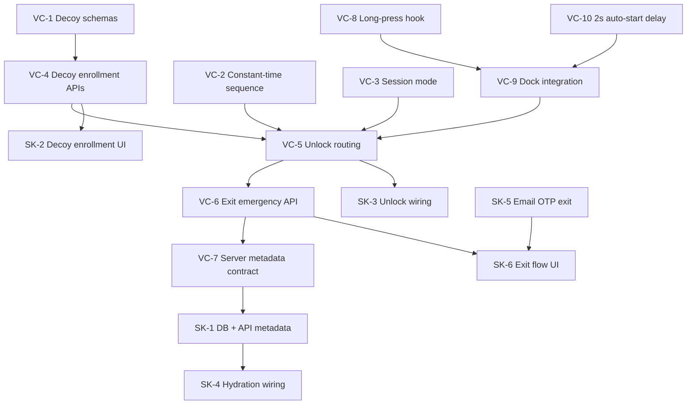

# ADR 0001 — GitHub Issue Breakdown

Companion to [0001-emergency-duress-mode.md](./0001-emergency-duress-mode.md). Each item is a
proposed GitHub issue. Prefix labels: `vault-core` or `selahkeep` (consumer).

**Legend:** P0 = blocking MVP · P1 = required for safe launch · P2 = polish / follow-up

---

## Dependency graph (high level)

---

## vault-core workstream

### VC-1 — Decoy vault record schemas

| Field | Value |
| --- | --- |
| **Priority** | P0 |
| **Depends on** | — |
| **Blocks** | VC-4, VC-5, SK-1 |

**Title:** `feat(core): add decoy vault record schemas and validation`

**Description:** Add Zod schemas and TypeScript types for optional decoy vault structures
(`VaultDecoyRecord`, `vaultSetupWithDecoySchema`) extending the persisted record without breaking
existing `vaultSetupEnvelopeFieldsSchema` consumers.

**Acceptance criteria:**

- [ ] Schema validates decoy `encryptedBlob`, `passwordEnvelope`, `recoveryEnvelope`, optional
  `passkeyPrfEnvelope` under the same `cryptoVersion` rules as primary vault.
- [ ] Primary-only records still parse (backward compatible).
- [ ] Unit tests for valid/invalid decoy records and tampered envelopes.
- [ ] `API_REFERENCE.md` documents new types.

---

### VC-2 — Constant-time duress sequence detection

| Field | Value |
| --- | --- |
| **Priority** | P0 |
| **Depends on** | — |
| **Blocks** | VC-5, SK-2 |

**Title:** `feat(core): constant-time duress sequence detection API`

**Description:** Export `containsDuressSequence(password, sequence)` that checks whether the
entered password contains the configured substring using a constant-time algorithm bounded by the
app's max password length.

**Acceptance criteria:**

- [ ] Returns `true` iff sequence is non-empty and appears as a contiguous substring.
- [ ] Empty sequence never matches (fail-safe).
- [ ] Timing does not short-circuit on first mismatch (regression test or documented constant-time
  construction).
- [ ] Rejects inputs exceeding configured max length before comparison.
- [ ] No password or sequence logged.

---

### VC-3 — Session mode (`normal` | `emergency`)

| Field | Value |
| --- | --- |
| **Priority** | P0 |
| **Depends on** | — |
| **Blocks** | VC-5, VC-6, VC-7 |

**Title:** `feat(browser): vault session mode for emergency state`

**Description:** Add `VaultSessionMode`, `getVaultSessionMode()`, `isVaultEmergencyMode()`, and
`enterVaultEmergencyMode()` to the browser session layer alongside existing lock/unlock APIs.

**Acceptance criteria:**

- [ ] Mode is in-memory only; cleared on lock but distinguishable from normal lock via server
  hydration path (consumer).
- [ ] `unlockVaultSession()` records whether the UVK is decoy or primary (internal tagging).
- [ ] Subscribers (`subscribeVaultSession`) notified on mode transitions.
- [ ] `lockVaultSession()` clears UVK; does not clear server emergency flag (documented).
- [ ] Tests cover normal → emergency → lock → re-hydrate flows.

---

### VC-4 — Decoy vault enrollment crypto APIs

| Field | Value |
| --- | --- |
| **Priority** | P0 |
| **Depends on** | VC-1, VC-2 |
| **Blocks** | VC-5, SK-2 |

**Title:** `feat(core): decoy vault creation and enrollment helpers`

**Description:** Add `createDecoyVaultSetup()` (or equivalent) to generate a fresh decoy UVK,
encrypt honey payload, create duress password envelope, and decoy recovery envelope. Validate duress
password contains sequence at enrollment.

**Acceptance criteria:**

- [ ] Decoy UVK is independently generated from primary UVK.
- [ ] Enrollment rejects duress password that does not contain configured sequence.
- [ ] Returns structures ready for consumer server persistence.
- [ ] Optional decoy passkey envelope creation reuses existing PRF wrap helpers.
- [ ] Examples in `IMPLEMENTATION_GUIDE.md` (draft section acceptable in same PR).

---

### VC-5 — Emergency-aware unlock routing

| Field | Value |
| --- | --- |
| **Priority** | P0 |
| **Depends on** | VC-1, VC-2, VC-3, VC-4 |
| **Blocks** | VC-6, SK-3, SK-4 |

**Title:** `feat(browser): emergency-aware password and passkey unlock routing`

**Description:** Orchestrate unlock target selection: primary vs decoy envelopes based on duress
sequence, long-press latch, and `emergencyModeActive` server snapshot. Refuse primary decrypt while
emergency mode is active.

**Acceptance criteria:**

- [ ] Password with sequence → decoy envelope only (when not already emergency-pinned, same path).
- [ ] Password without sequence → primary envelope when mode is normal.
- [ ] When emergency-pinned, all unlock attempts use decoy paths only.
- [ ] Passkey with duress latch → decoy UVK after successful PRF.
- [ ] Successful decoy unlock calls `enterVaultEmergencyMode()` and invokes consumer callback to
  persist server flag.
- [ ] Rate-limit action keys documented (`password`, `passkey_prf`, `emergency_exit`).
- [ ] Security regression: primary `encryptedBlob` never decrypted in emergency mode.

---

### VC-6 — Exit emergency mode API

| Field | Value |
| --- | --- |
| **Priority** | P0 |
| **Depends on** | VC-3, VC-5 |
| **Blocks** | SK-5, SK-6 |

**Title:** `feat(browser): exit emergency mode with recovery phrase gate`

**Description:** Implement `exitEmergencyMode()` verifying the **primary** recovery phrase against
the real `recoveryEnvelope`, accepting optional `emailOtp` when consumer requires it, then locking
session and resetting mode to normal.

**Acceptance criteria:**

- [ ] Primary recovery phrase required (12- or 24-word); decoy recovery phrase insufficient.
- [ ] Normal vault password does **not** exit emergency mode (explicit test).
- [ ] On success: `lockVaultSession()`, mode `normal`, consumer clears `emergencyModeActive`.
- [ ] Wrong recovery phrase fails without leaking which envelope was tested.
- [ ] Document OTP as consumer-prevalidated optional gate.

---

### VC-7 — Server metadata contract and status snapshot

| Field | Value |
| --- | --- |
| **Priority** | P1 |
| **Depends on** | VC-3 |
| **Blocks** | SK-1, SK-4 |

**Title:** `feat(react): extend VaultServerStatusSnapshot for emergency metadata`

**Description:** Document `VaultEmergencyServerMetadata` schema and extend
`VaultServerStatusSnapshot` with `emergencyModeActive`, `decoyConfigured`. Update
`resolveVaultClientStatus` or add parallel resolver for emergency-aware UI copy.

**Acceptance criteria:**

- [ ] Types exported from `@tgoliveira/vault-core/react`.
- [ ] `IMPLEMENTATION_GUIDE.md` persistence section updated.
- [ ] SQL reference snippet (consumer-owned migration) in `docs/schemas/` if applicable.
- [ ] Status dock copy hooks accept emergency state (no misleading “unlocked” trust indicators).

---

### VC-8 — Long-press duress signal hook

| Field | Value |
| --- | --- |
| **Priority** | P0 |
| **Depends on** | — |
| **Blocks** | VC-9 |

**Title:** `feat(react): useLongPressDuressSignal hook for 1s press detection`

**Description:** Export a reusable React hook (e.g. `useLongPressDuressSignal({ thresholdMs: 1000 })`)
returning pointer event handlers and a latched `duressSignaled` flag consumable by unlock flows.

**Acceptance criteria:**

- [ ] Fires when press duration ≥ 1000 ms on bound element.
- [ ] Short click does not set latch.
- [ ] Pointer cancel / leave cancels pending long-press.
- [ ] Touch and mouse supported.
- [ ] Latch resets after unlock attempt or explicit reset API.
- [ ] Unit tests with fake timers.

---

### VC-9 — Dock long-press integration (handle + passkey button)

| Field | Value |
| --- | --- |
| **Priority** | P0 |
| **Depends on** | VC-8, VC-10 |
| **Blocks** | SK-3 |

**Title:** `feat(react): long-press duress detection on VaultStatusDock and passkey button`

**Description:** Wire `useLongPressDuressSignal` to the dock handle and
`VaultDockQuickUnlock` passkey button. Plumb `duressSignaled` to consumer via callback prop
`onDuressSignalChange` or unlock props.

**Acceptance criteria:**

- [ ] Long-press on collapsed dock handle (≥ 1 s) sets duress latch before expand completes.
- [ ] Long-press on passkey button sets latch; short click does not.
- [ ] Consumer receives latch state when invoking passkey unlock.
- [ ] `data-vault-dock-ignore-activity` preserved for handle.
- [ ] Tests for handle and button long-press vs short-press.

---

### VC-10 — Passkey auto-start 2 s delay

| Field | Value |
| --- | --- |
| **Priority** | P0 |
| **Depends on** | — |
| **Blocks** | VC-9 |

**Title:** `feat(react): delay dock passkey auto-start to 2s for duress long-press`

**Description:** Change `VaultStatusDock` passkey auto-start from immediate to default **2000 ms**
after expand via `passkeyAutoStartDelayMs` prop (default `2000`). Clear timer on collapse.

**Acceptance criteria:**

- [ ] Auto-start fires 2 s after expand when passkey is primary and `autoStartPasskey` is true.
- [ ] Long-press on handle within 2 s window can complete before ceremony starts.
- [ ] `passkeyAutoStartDelayMs={0}` restores immediate behavior for tests.
- [ ] Timer cleared on collapse; no duplicate ceremonies.
- [ ] Existing dedupe (`tryConsumePasskeyAutoStart`) still respected.
- [ ] Update dock tests that assume immediate auto-start.

---

### VC-11 — Testing helpers for emergency mode

| Field | Value |
| --- | --- |
| **Priority** | P1 |
| **Depends on** | VC-3, VC-5 |
| **Blocks** | SK-7 |

**Title:** `feat(testing): emergency mode session and decoy fixtures`

**Description:** Add `@tgoliveira/vault-core/testing` helpers: decoy vault fixtures, 
`assertVaultSessionMode`, honey sentinel strings for integration tests.

**Acceptance criteria:**

- [ ] Fixture creates primary + decoy record pair for deterministic tests.
- [ ] `assertVaultSessionMode("emergency")` throws on mismatch.
- [ ] Documented in testing section of `IMPLEMENTATION_GUIDE.md`.

---

### VC-12 — Documentation and changelog (vault-core release)

| Field | Value |
| --- | --- |
| **Priority** | P1 |
| **Depends on** | VC-1 through VC-10 (shipped APIs) |
| **Blocks** | — |

**Title:** `docs: emergency duress mode API reference and consumer guide`

**Description:** Update `CHANGELOG.md` [Unreleased], `API_REFERENCE.md`, `IMPLEMENTATION_GUIDE.md`,
`CURRENT_PRODUCT_SURFACE.md`, `docs/CONSUMER_SECURITY_REQUIREMENTS.md`, and `docs/adr/README.md` index
(status → Accepted).

**Acceptance criteria:**

- [ ] All new exports documented with security preconditions.
- [ ] Consumer checklist includes emergency flag persistence and exit rate limits.
- [ ] `CURRENT_PRODUCT_SURFACE.md` lists emergency APIs as shipped when released.
- [ ] ADR 0001 status updated to Accepted.

---

## SelahKeep (consumer) workstream

### SK-1 — Server persistence for emergency metadata

| Field | Value |
| --- | --- |
| **Priority** | P0 |
| **Depends on** | VC-7 |
| **Blocks** | SK-3, SK-4, SK-6 |

**Title:** `feat(selahkeep): persist emergencyModeActive and duress configuration`

**Description:** Add DB columns and API fields for `emergencyModeActive`, `emergencyModeEnteredAt`,
`duressSequence`, `decoyConfigured`, `emergencyExitEmailRequired`. Atomic updates on emergency
entry/exit.

**Acceptance criteria:**

- [ ] `assertNoVaultPlaintextFields()` on all routes.
- [ ] Authenticated user can read own metadata; only exit flow clears `emergencyModeActive`.
- [ ] Reload with `emergencyModeActive: true` returns snapshot to client.
- [ ] Migration documented.

---

### SK-2 — Decoy vault enrollment UX

| Field | Value |
| --- | --- |
| **Priority** | P0 |
| **Depends on** | VC-4, VC-2 |
| **Blocks** | SK-3 |

**Title:** `feat(selahkeep): decoy vault enrollment and duress sequence setup`

**Description:** Settings flow for duress sequence, duress password (must contain sequence), decoy
honey content, and optional decoy passkey enrollment. Uses `createDecoyVaultSetup()`.

**Acceptance criteria:**

- [ ] User can configure sequence and duress password with inline validation.
- [ ] User can populate believable honey content.
- [ ] Server stores decoy record encrypted fields only.
- [ ] `decoyConfigured` set true after completion.
- [ ] Education copy explains primary vs secondary triggers.

---

### SK-3 — Unlock flow wiring (password + passkey)

| Field | Value |
| --- | --- |
| **Priority** | P0 |
| **Depends on** | VC-5, VC-9, SK-1, SK-2 |
| **Blocks** | SK-7 |

**Title:** `feat(selahkeep): wire emergency unlock routing on dock and full unlock page`

**Description:** Integrate vault-core emergency routing on all unlock paths (dock, full page).
Pass duress latch from dock; persist `emergencyModeActive` on decoy entry.

**Acceptance criteria:**

- [ ] Sequence-in-password opens honey vault on full unlock and dock.
- [ ] Long-press passkey opens honey vault; short passkey opens real vault.
- [ ] Emergency-pinned session never shows real vault on normal password.
- [ ] `withVaultUnlockRateLimit` on every path.
- [ ] Lock cleanup clears honey plaintext from app state.

---

### SK-4 — Emergency state hydration on app load

| Field | Value |
| --- | --- |
| **Priority** | P0 |
| **Depends on** | SK-1, VC-7 |
| **Blocks** | SK-3 |

**Title:** `feat(selahkeep): hydrate emergency mode from server on session start`

**Description:** On authenticated load, pass `emergencyModeActive` into `VaultServerStatusSnapshot`
and gate unlock/decrypt until user unlocks into decoy when flag is set.

**Acceptance criteria:**

- [ ] Reload while emergency active does not expose real vault.
- [ ] Dock reflects emergency state in copy/status.
- [ ] User must unlock (decoy path) after reload to see honey content.

---

### SK-5 — Email OTP for emergency exit

| Field | Value |
| --- | --- |
| **Priority** | P1 |
| **Depends on** | VC-6 |
| **Blocks** | SK-6 |

**Title:** `feat(selahkeep): email OTP gate for emergency mode exit`

**Description:** When user configured recovery email, require OTP to complete `exitEmergencyMode()`.
Consumer sends OTP, verifies, passes token to exit API.

**Acceptance criteria:**

- [ ] OTP required only when `emergencyExitEmailRequired` is true.
- [ ] Rate-limited send and verify endpoints.
- [ ] OTP never stored in vault envelopes.
- [ ] Exit fails closed if email required but OTP missing/invalid.

---

### SK-6 — Emergency exit UX (recovery phrase)

| Field | Value |
| --- | --- |
| **Priority** | P0 |
| **Depends on** | VC-6, SK-5 |
| **Blocks** | — |

**Title:** `feat(selahkeep): emergency mode exit screen with recovery phrase`

**Description:** Dedicated exit flow collecting 12/24-word primary recovery phrase and optional OTP.
On success, clears server flag and returns user to normal locked state.

**Acceptance criteria:**

- [ ] Normal password unlock does not show exit or clear emergency.
- [ ] Recovery phrase validated via vault-core `exitEmergencyMode()`.
- [ ] Success requires re-unlock for real vault.
- [ ] Clear UX that user is in emergency/decoy mode.

---

### SK-7 — Honey vault content and plausible UX

| Field | Value |
| --- | --- |
| **Priority** | P1 |
| **Depends on** | SK-2, SK-3 |
| **Blocks** | — |

**Title:** `feat(selahkeep): honey vault content templates and emergency mode presentation`

**Description:** Believable decoy notes/content templates; subtle emergency indicator for legitimate
user (configurable). No obvious “DECOY MODE” banner to coercer.

**Acceptance criteria:**

- [ ] Default honey templates available at enrollment.
- [ ] Emergency indicator visible only when consumer configures it (e.g. settings toggle).
- [ ] Coercer-facing UI indistinguishable from normal unlocked vault.

---

### SK-8 — Integration and E2E tests

| Field | Value |
| --- | --- |
| **Priority** | P1 |
| **Depends on** | SK-3, SK-6, VC-11 |
| **Blocks** | — |

**Title:** `test(selahkeep): emergency duress mode integration tests`

**Description:** E2E tests: sequence password, long-press passkey, reload persistence, exit via
recovery, negative cases (normal password does not exit).

**Acceptance criteria:**

- [ ] `assertNoVaultPlaintextInDocument()` after lock.
- [ ] Real vault sentinels absent in emergency session.
- [ ] Reload test with `emergencyModeActive` true.
- [ ] CI green.

---

## Suggested implementation order

| Phase | Issues | Goal |
| --- | --- | --- |
| **1 — Crypto foundation** | VC-1, VC-2, VC-3, VC-4 | Schemas, detection, session mode, enrollment |
| **2 — Unlock + exit** | VC-5, VC-6, VC-7 | Routing and recovery exit |
| **3 — Dock UX** | VC-8, VC-10, VC-9 | Long-press + 2 s delay |
| **4 — Consumer core** | SK-1, SK-2, SK-4, SK-3 | Persistence and wiring |
| **5 — Exit + polish** | SK-5, SK-6, SK-7, VC-11, VC-12, SK-8 | OTP, UX, docs, tests |

---

## Issue title quick reference

| ID | Title |
| --- | --- |
| VC-1 | `feat(core): add decoy vault record schemas and validation` |
| VC-2 | `feat(core): constant-time duress sequence detection API` |
| VC-3 | `feat(browser): vault session mode for emergency state` |
| VC-4 | `feat(core): decoy vault creation and enrollment helpers` |
| VC-5 | `feat(browser): emergency-aware password and passkey unlock routing` |
| VC-6 | `feat(browser): exit emergency mode with recovery phrase gate` |
| VC-7 | `feat(react): extend VaultServerStatusSnapshot for emergency metadata` |
| VC-8 | `feat(react): useLongPressDuressSignal hook for 1s press detection` |
| VC-9 | `feat(react): long-press duress detection on VaultStatusDock and passkey button` |
| VC-10 | `feat(react): delay dock passkey auto-start to 2s for duress long-press` |
| VC-11 | `feat(testing): emergency mode session and decoy fixtures` |
| VC-12 | `docs: emergency duress mode API reference and consumer guide` |
| SK-1 | `feat(selahkeep): persist emergencyModeActive and duress configuration` |
| SK-2 | `feat(selahkeep): decoy vault enrollment and duress sequence setup` |
| SK-3 | `feat(selahkeep): wire emergency unlock routing on dock and full unlock page` |
| SK-4 | `feat(selahkeep): hydrate emergency mode from server on session start` |
| SK-5 | `feat(selahkeep): email OTP gate for emergency mode exit` |
| SK-6 | `feat(selahkeep): emergency mode exit screen with recovery phrase` |
| SK-7 | `feat(selahkeep): honey vault content templates and emergency mode presentation` |
| SK-8 | `test(selahkeep): emergency duress mode integration tests` |
